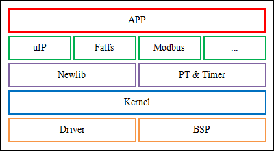
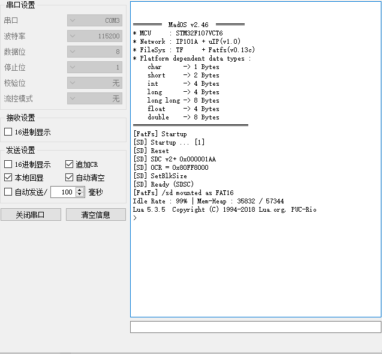

# 简介

**MadOS** 是一个 **实时操作系统**

任何应用程序都运行于操作系统之中，例如，QQ 与 Windows。操作系统为应用程序提供运行环境并与驱动程序一起处理与硬件相关的工作。QQ 的开发者无需关心摄像头如何捕获数据，他只需要一个简单的 API 调用以获取摄像头采集到的数据，他关心的是输入的参数及相应的结果，至于 API 内部如何运作与他并无关系。如此，应用程序开发者可以专注于应用程序本身，而无需关心操作系统或驱动程序的细节，开发效率与软件质量自然因为专注而大大提高。

简而言之，MadOS 即运行于单片机中的 Windows。

     
    
MadOS系统架构

## 核心模块
| 序号 | 名称 | 说明 |
|:----:|:----:|:----|
| 1 | 全局功能模块 | 负责系统的初始化、启动。 |
| 2 | 内存管理模块 | 负责系统运行时的动态内存分配、回收。 |
| 3 | 线程管理模块 | 负责系统运行时建立、监控、销毁线程。 |
| 4 | 延时管理模块 | 为线程提供基于SystemTick的延时API。|
| 5 | 信号管理模块 | 为线程提供信号量操作的相关 API。 |
| 6 | 互斥信号模块 | 为线程提供互斥信号量操作相关 API。 |
| 6 | 消息队列模块 | 为线程提供消息队列操作的相关 API。 |
| 7 | 事件管理模块 | 为线程提供基于事件响应机制的相关 API。 |
| 8 | 快速缓存模块 | 提供快速、伪动态内存分配方式，适合需频繁重用的动态内存分配。 |
| 9 | 等待队列模块 | 为IO驱动层提供等待队列机制，用以支持高级特性。 |

## 核心扩展
| 序号 | 名称 | 说明 |
|:----:|:----:|:----|
| 1 | PT     | 协程，用于二级调度。 |
| 2 | Timer  | 定时器，专用于支持协程。 |
| 3 | Newlib | 标准C库，集成于工具链中。 |

## 开发环境(推荐)
| 序号 | 名称 | 说明 |
|:----:|:----:|:----|
| 1 | 代码编辑器 | Visual Studio Code |
| 2 | 代码编译器 | GCC (GNU Tools for MadOS) |
| 3 | 在线调试器 | GDB + OpenOCD |

## MadOS 启动样例

     

