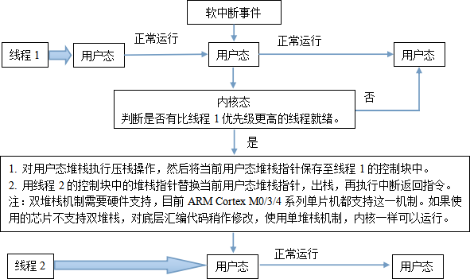
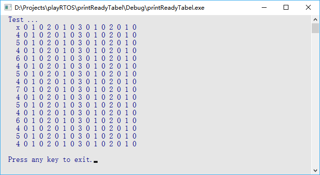
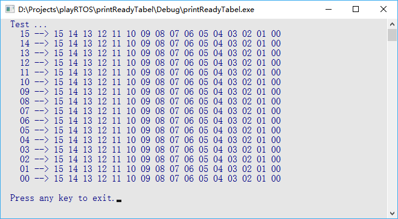
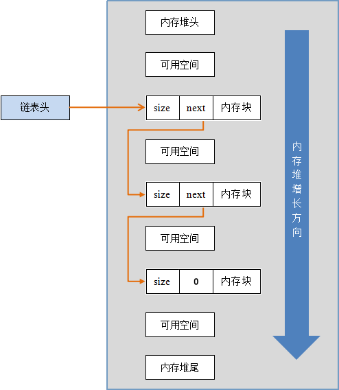

# 设计简要

## 线程控制块
在 **MadOS** 的设计中，每个线程的信息都记录在一个线程控制块中: 
```c
typedef struct _MadTCB_t {
    MadStk_t  *pStk;         // 线程堆栈指针
    MadU8     prio;          // 线程优先级
    MadU8     state;         // 线程当前状态
    MadTim_t  timeCnt;       // 线程延时计数值
    MadTim_t  timeCntRemain; // 线程恢复时，timeCnt 的剩余值。
    MadU8     *msg;          // 线程所获得的消息(用于消息队列模块)
    MadUint   eventMask;     // 线程事件掩码(用于事件控制模块)
    MadU16    rdyg_bit;      // 线程优先级组位
    MadU16    rdy_bit;       // 线程优先级位
    MadRdyG_t *xCB;          // 线程正在等待的就绪条件的就绪表指针
    MadU8     err;           // 线程恢复时，记录产生的错误。
} MadTCB_t;
```
::: tip
刚启动时，系统中实际上只有一个线程 --- **空闲线程**。  
系统运行时，它负责在其余线程都未就绪时“消磨时间”，所以其具有最低优先级。
:::

## 线程切换流程
<center>
    <br><br>
    <div style="color: black;">切换线程即切换堆栈</div>
</center>

## 线程就绪
各线程优先级存在差异，优先级低的线程若想运行，必然等优先级高的线程因某种原因挂起。寻找最优就绪线程最简单的方法即：将所有的线程控制块按顺序排列，每个线程控制块中有一个标志标明线程是否就绪，查找时从前向后查找每个线程控制块，遇到就绪的线程立即停止查找，停止处即最优就绪线程。但，该方式有两个缺陷：
- 找到即停的方式没有确定的查找时间，系统运行时线程频繁切换，最终系统损失掉实时特性；
- 顺序查找算法非常费时，系统运行时线程频繁切换，效率损失严重。  

MadOS 采用的是“**就绪表**”机制，假设：
- 系统最大线程数为 8；
- 最高优先级为 0，最低优先级为 7。   

简单来说，如果系统内最大线程数设置为 8，那就定义一个包含 8Bit 的数据，每一 Bit 对应一个优先级，当对应的 Bit 置 1，表示线程就绪，置 0 则表示线程挂起。   

| B7 | B6 | B5 | B4 | B3 | B2 | B1 | B0 |
| :-:| :-:| :-:| :-:| :-:| :-:| :-:| :-:|
| 0/1| 0/1| 0/1| 0/1| 0/1| 0/1| 0/1| 0/1|

可以看出:   
- 当 B0 被置 1，此时不管剩余 Bit 为何值，最优就绪线程的优先级就是 0。
- 当 B0 为 0，B1 为 1，此时不管剩余 Bit 为何值，最优就绪线程的优先级就是 1。
- 依次类推……

利用这样的规律，可以制作一张表，使得输入是 8Bit 数据的值，而输出则是最优就绪线程的优先级:   
<center>
    <br>
    <div style="color: black;">就绪表</div>
</center>

注：因为空闲线程总是就绪的，所以 8Bit 数据的值一定不会为 0，因此第一个元素可以是任意数。    

这张表，即就绪查找表，的制作规律是：从 8Bit 数据的右向左，记录连续 0 的个数 Cnt，Cnt 就是当前 8Bit 数据值对应的最高优先级。上表就是笔者利用该规律，编写了一个小程序，自动输出的。在代码中，将该表中的数据，依据自左向右，自上向下的顺序定义为一个一维数组，即可通过数组快速索引优先级。  

可以看出，8Bit 数据只能表示出 8 个线程，去掉一个空闲线程，实际可用的只剩下了 7 个线程，这对于一个系统来说，太局限了。因此，在 MadOS 中，将上述的 8Bit 数据扩展为 16Bit，使得一个数据可以表示 16 个线程，在此基础上，MadOS 再加入线程分组的机制，定义一个优先级组和一个优先级数组: 
```c
MadU16 MadThreadRdyGrp;
MadU16 MadThreadRdy[MAD_THREAD_RDY_NUM];
// MAD_THREAD_RDY_NUM 视最大线程数而定。
```
<center>
    <br>
    <div style="color: black;">优先级分组示意</div>
</center>

- 左侧一列表示优先级组，用于查找优先级的高 4Bit --- prio_h
- 得到 prio_h，再到对应的组中查找优先级的低 4Bit --- prio_l
- 所得优先级: prio = (prio_h << 4) + prio_l

这样做使得优先级的最大值扩展为 256，对于大多数的应用来说，已经足够了。但，这样做却带来另一个问题，即在制作就绪查找表时，需要 65536(16Bit 数的最大值)字节的存储空间，对于资源相对有限的单片机，这个结果是灾难性的。 

MadOS 的做法是“因地制宜”:
- 如果使用的是 ARM Cortex M0/3/4 系列单片机，则可以利用其特有的两条汇编指令，按照生成就绪查找表的原理，直接查询优先级: 
```c
#define madUnRdyMap(res, src) { res = src; __asm{ rbit res, res; clz res, res; } }
```
- 如果使用的单片机没有上述类似的汇编指令，则可以选择将优先级组与优先级数组的位宽降至8Bit，这样最大线程数变为 64，对于一般应用也是足够的。或者，选择牺牲少许性能，用代码重现 ARM Cortex M0/3/4 系列单片机特有的那两条汇编指令。

利用就绪表机制，每次查找最优就绪线程都只执行一次查表操作，而查表操作的时间是确定的。

## 动态内存管理
动态内存管理是所有编程人员的“梦魇”，在大多数实时操作系统中，要么并未包含该模块，要么则是采用比较保守的“块分配”模式，前者直接将问题抛给应用编程人员，后者则使得内存大量浪费。

MadOS 采用“堆叠”式的动态内存分配方式。每一块被分配内存的开头由一个数据结构占据:
```c
typedef struct _MadMemHead_t
{
    MadUint               size;  // 内存块的尺寸，单位为字节。
    struct _MadMemHead_t  *next; // 下一块内存块的首地址。
} MadMemHead_t;
```
每一块被分配的内存，以单链表的形式，按照内存块首地址值的升序，连接在一起。

欲分配内存时，MadOS 从内存堆首地址开始扫描，以内存堆尾地址作为结束，查找相邻两个块之间的可用空间，如果比需求尺寸大，则在该块空间上“割”出所需空间：
<center>
    <br>
    <div style="color: black;">动态内存堆示意</div>
</center>
如果尺寸不足，则继续向后扫描，如果所有的可用空间都小于所需的尺寸，则分配失败。

MadMemHead_t 是供内存管理模块所用，实际返回给调用者的内存块首地址则是结构体: 
<center>
    
</center> 
中“内存块”的首地址。另外，在 MadOS 的动态内存分配函数中一律按照所使用的单片机的内存地址对齐方式进行分配，实际分配的内存大小: 
```c
size = 字节对齐处理(sizeof(MadMemHead_t)) + 字节对齐处理(用户所需字节数)
```
例如，ARM Cortex M3 是 4 字节对齐，那么当用户需要分配 29 字节内存时，分配成功的情况下，实际分配的内存字节数为，8 + 32 = 40 字节，用户实际可用为 32 字节。在后续模块说明中会看到，MadOS 专门设计的 API 可以利用参数返回实际可用的字节数。

按照地址对齐方式分配内存的最大优点是提高程序效率。因为，单片机一般都具有与其对齐方式相匹配的汇编指令，然而，如果内存地址并未做对齐处理，代码编译时，某些编译器会生成按单字节处理的代码，原本一条指令可以完成的工作，则变成多条指令去完成，当内存块比较大时，性能方面的损失将陡增。

所有被分配的内存块，用一条单链表相连，当需要回收已分配的内存时，只需将对应的节点从单链表中删除即可。回收内存时，首先是将欲回收的指针与链表中的指针做比较，如果其存在于链表中，则将对应节点删除，如果其不存在于链表中，则忽略回收操作。这样的方式可以极大的避免误回收操作，例如，当两个线程同时回收同一块内存时，后进行的回收操作将被忽略。

## 快速缓存
快速缓存是建立在动态内存管理之上的伪动态内存管理机制。用于快速分配、回收那些经常被反复使用的内存块，以便提升系统的整体运行效率。

使用快速缓存时，一个快速缓存池首先被建立，每次应用需要动态内存时，都从该快速缓存池中“拿走”一个或多个固定大小的分块，当应用不再需要动态内存时，再将这些固定大小的分块“放回”快速缓存池。

快速缓存机制实际上是一种“以空间换时间”的策略。某块内存作为快速缓存池被分配给某个应用后，即便该应用完全不使用该快速缓存池，该块内存也无法被其他应用使用。    

## 指向指针的指针
为了保证数据一致性，通常使用指针(以下简称 p)来访问一个数据块。例如 MadOS 中许多功能控制块(以下简称 block)的建立函数都是返回一个指向该 block 数据的指针。

当需要删除 block 时，如果是以 p 作为实参传入删除函数，那么 block 所占的内存是可以正确释放的，但是，想要将指向 block 的指针清 0 是无法做到的，因为删除函数中的形参与实参 p 所在的内存位置是不同的，使形参等于 0 并不能导致实参也变为 0。

通常，删除 block 时，同时需要将 p 清 0，以保证不会有“野指针”留在内存当中造成隐患。另外，在诸如 LwIP、FatFS 等第三方模块中，也要求删除 block 时能够同时将 p 清 0。

因此，MadOS 中对 block 进行操作的函数一律是以指向 p 的指针(即&p)作为实参传入的，如此，在
函数中只需*p = 0，即可将 p 清 0。

## 特殊信号量
使用 sem = madSemCreate(0)将会建立一个特殊的信号量 sem:

- 每次调用 madSemRelease(&sem) 时：
    - 若无线程正在等待 sem，那么该操作“什么也不做”；
    - 若有线程正在等待 sem，正常释放信号量以恢复一个正在等待该 sem 的线程。
- 每次调用 madSemWait(&sem, x) 时，都将使当前线程进入等待 sem 的状态，从而挂起当前线程。

在某些应用中，在等待某个 sem 前，希望忽略之前所有释放 sem 的操作，比如：一个线程要等待一个按键触发时，希望忽略开始等待前的所有触发，以便正确接收开始等待后的第一个触发。

在 MadMessage 中，使用这种特殊信号量对消息队列进行锁定的。当队列未满时，所有释放 sem 的操作都被忽略，当队列满时，即可正确等待邮箱的“推出消息”操作。有时，会希望在临界区内等待这种信号量，MadOS 提供了 madSemWaitInCritical()满足该要求，详见模块介绍。

## 双堆栈机制
为了避免中断嵌套带来的麻烦，一般的内核会记录中断嵌套层数，以便正确入 / 出栈，这种做法会导致内核出现运行效率下降、时间不确定性、线程堆栈溢出风险。

MadOS 中，所有中断共用同一个堆栈，该堆栈独立于所有的线程堆栈，即双堆栈机制:     
- 由于中断函数不使用线程堆栈，线程堆栈使用情况非常稳定，可完全避免非设计溢出。
- 由于不用关心中断嵌套层数，即无需为每次中断单独入 / 出栈，整体运行效率大幅提高。
- 由于不用关心中断嵌套层数，中断损耗极低，大幅降低时间不确定性。
