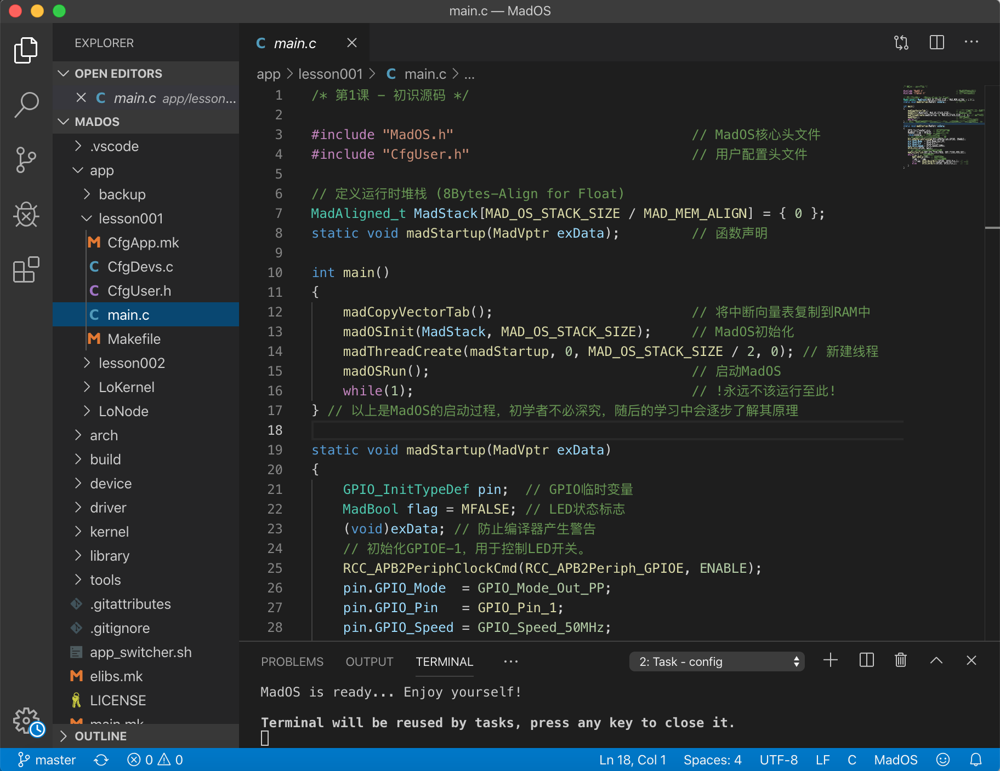
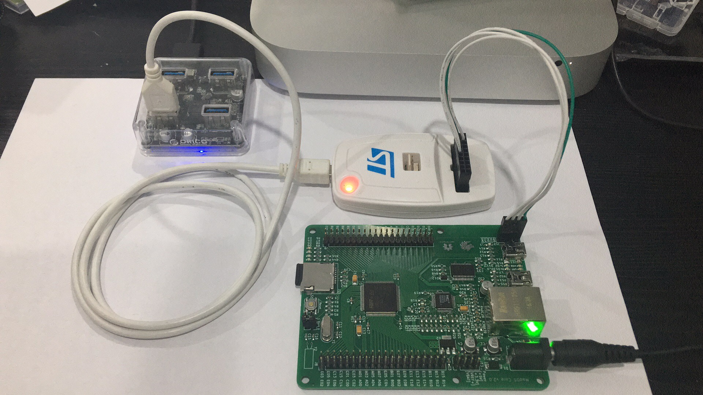
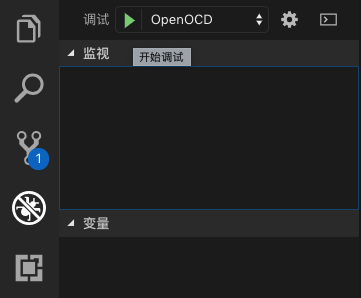
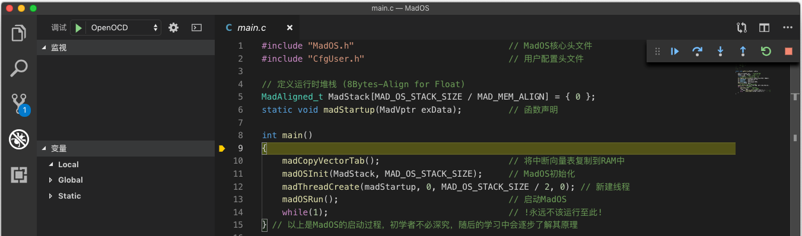

# 初识源码

## 获取源码
[MadOS 源码仓库](https://github.com/long568/MadOS)
::: tip
初学者请选择master分支， 产品应用可选择经过严格验证的release版本。
:::

## 展开源码
将 **MadOS** 文件夹拖入 **VSCode** 中:


### 目录结构
``` bash
# 开发者无需关心的内容以 n 标记。
# 开发者可以参考的内容以 - 标记。
# 开发者需要关心的内容以 y 标记。
MadOS
├─ .vscode/        # n : VSCode 相关配置
├─ app/            # y : 项目源码(其中每个子目录为一个项目)
│  ├─ lesson001/   # - : MadOS应用教程第一课，稍后我们会展开分析它。
│  ├─ LoArm/       # - : 遥控机械臂，包含步进 / 直流电机驱动、网络通信逻辑，尚需完善。
│  ├─ LoIoT/       # - : 物联网节点，包含Lora模块驱动，云端传输、传感器读取逻辑。
│  ├─ LoNode/      # - : LoBoard开发板配套例程，不断完善中。
│  ├─ test_kernel/ # n : MadOS功能压力测试。
│  ├─ test_module/ # - : LoBoard开发板配套例程，后续将转移至 LoNode 中。
│  └─ ...          # - : 未来，我们将开放更多示例供开发者参考。
├─ arch/           # n : MCU架构相关源码
├─ build/          # n : 编译过程文件存放处(源码编译时自动生成)
├─ device/         # n : 设备模块源码
├─ driver/         # n : 驱动源码
├─ kernel/         # n : 内核源码
├─ library/        # n : 第三方库源码
├─ tools/          # n : MadOS环境配置相关工具
├─ .gitattributes  # n : git属性文件
├─ .gitignore      # n : git过滤文件
├─ app_switcher.sh # y : 工作App切换器，详见后述。
├─ elibs.mk        # n : 第三方库配置
├─ LICENSE         # n : 许可证
├─ main.mk         # n : 真实主编译文件(临时生成)
├─ Makefile        # n : 影子主编译文件
└─ rules.mk        # n : 编译规则定义
```
::: tip
- 如果您是操作系统爱好者，也许对 **arch、kernel、device、driver** 中的内容会感兴趣。  
- 如果您是初学者、开发者，则只需关心 **app** ，即您的项目源码，以便快速实现想法。  
- MadOS尚未包含某些驱动或第三方库，如有需要，您可:
    - 联系 [我们](/Story/) 进行添加
    - 访问 [社区](http://club.digiic.com/Forum/PostIndex/s-72.html) 搜索一下
    <!-- - 访问 [社区](https://github.com/long568/MadOS/issues) 搜索一下 -->
:::

## 切换项目
在 **MadOS** 根目录下有名为 **app_switcher.sh** 的脚本，用以切换当前工作项目: 
``` bash
# export MADOS_WORKING_APP=test_kernel
# export MADOS_WORKING_APP=test_module
export MADOS_WORKING_APP=lesson001
# export MADOS_WORKING_APP=LoArm
# export MADOS_WORKING_APP=LoIoT
# export MADOS_WORKING_APP=LoNode
```
将 **lesson001** 前的注释去掉，并注释余项目，然后在VSCode中运行 **config** 任务：
::: tip
终端 -> 运行任务 -> config
``` bash
MadOS is ready... Enjoy yourself!
```
:::

## 项目结构
``` bash
lesson001
├─ CfgApp.mk # 项目配置
├─ CfgDevs.c # 设备列表
├─ CfgUser.h # 用户配置
├─ main.c    # 工程源码(主文件)
└─ Makefile  # 编译文件
```
::: tip
- 如果您是初学者、开发者，只需关心 **main.c** ，即您的项目源码，以便快速实现想法。
- 为便于后续学习，我们依然对每个文件进行初步介绍，您可快速浏览，以备不时之需。
:::

### CfgApp.mk
``` makefile
# MCU架构配置
export MCU_ARCH     = armv7-m
export MCU_VER      = cortex-m3
export MCU_PREFIX   = stm32f10x
export MCU_SUFFIX   = cl
export MCU_RAM_SIZE = 0x10000
export MCU_FLS_SIZE = 256K
# 工程特定编译选项
export PRJ_CFLAGS  = -Os
export PRJ_LDFLAGS = --specs=nano.specs
```

### CfgDevs.c
``` c
// 第一课中未启用任何设备，设备列表为空。
#include "MadDev.h"
MadDev_t *DevsList[] = {
    MNULL
};
```

### CfgUser.h
``` c
// MadOS支持最大256个任务优先级，数字越大优先级越低。
// 开发者需根据自身需要进行配置，并避开MadOS内部已使用的优先级。
// 最低优先级为空闲线程使用，次低优先级为统计线程(可选)使用，另建议保留优先级 0。
enum {
   THREAD_PRIO_SYS_RUNNING = 1,  // 标记系统正在运行的线程(周期性闪烁Led)
   THREAD_PRIO_DRIVER_ETH        // 编译网络驱动层所需
};
// 通常，中断优先级都与驱动相关。
// 中断优先级统一于此处枚举，便于高级开发者查阅、更改。
// 优先级1、15为MadOS内部保留，其余优先级可供项目使用。
enum {
    ISR_PRIO_SYSTICK    = 1,
    ISR_PRIO_ARCH_MEM,
    ISR_PRIO_DISK,
	ISR_PRIO_ETH,
    ISR_PRIO_DEV_USART,
    ISR_PRIO_TTY_USART,
    ISR_PRIO_PENDSV     = 15
};
// 堆空间定义(硬件相关)
#define MAD_OS_STACK_SIZE (56 * 1024)
```

### Makefile
``` makefile
# 将项目路径下所有.c文件输入编译系统。
export TEMP = $(BUILD_DIR)/app
ASMS =
SRCS = $(wildcard *.c)
include $(RULES)
after_all:
	$(LD) $(wildcard $(BUILD_DIR)/app/*.o) $(LDFLAGS) -o $(TARGET).elf
	$(OCPY) -O ihex $(TARGET).elf $(TARGET).hex
```

### main.c
``` c
#include "MadOS.h"   // MadOS核心头文件
#include "CfgUser.h" // 用户配置头文件

// 运行时堆栈 (8Bytes-Align for Float)
MadAligned_t MadStack[MAD_OS_STACK_SIZE / MAD_MEM_ALIGN] = { 0 };

// 函数声明
static void madStartup(MadVptr exData);

// 初始化
int main()
{
    ...   
}

// 线程
static void madStartup(MadVptr exData)
{
    ...
}
```

#### 运行时堆栈
运行时堆栈的空间由硬件决定。  
任何项目的运行时堆栈皆可由下式定义:
``` c
MadAligned_t MadStack[MAD_OS_STACK_SIZE / MAD_MEM_ALIGN] = { 0 };
```

#### 初始化
下述初始化流程可适用于任何项目。  
启动MadOS后，程序会跳转至新建线程中运行。  
第一课中，我们只建立一个线程，意在简明，线程优先级取 0。
``` c
int main()
{
    madCopyVectorTab();                         // 将中断向量表复制到RAM中
    madOSInit(MadStack, MAD_OS_STACK_SIZE);     // MadOS初始化
    madThreadCreate(madStartup, 0, MAD_OS_STACK_SIZE / 2, 0); // 新建线程
    madOSRun();                                 // 启动MadOS
    while(1);                                   // !永远不该运行至此!
} // 以上是MadOS的启动过程，初学者不必深究，随后的学习中会逐步了解其原理
```

#### 线程
开发者在线程中实现想法，每个线程都是一个无限循环。
::: tip
使用线程管理API，可以新建、挂起、恢复、删除线程。
:::
``` c
static void madStartup(MadVptr exData)
{
    GPIO_InitTypeDef pin;  // GPIO临时变量
    MadBool flag = MFALSE; // LED状态标志
	(void)exData;          // 防止编译器产生警告

    // 初始化GPIOE-1，用于控制LED开关。
    RCC_APB2PeriphClockCmd(RCC_APB2Periph_GPIOE, ENABLE);
    pin.GPIO_Mode  = GPIO_Mode_Out_PP;
	pin.GPIO_Pin   = GPIO_Pin_1;
	pin.GPIO_Speed = GPIO_Speed_50MHz;
	GPIO_Init(GPIOE, &pin);

    // 初始化SysTick，脉动间隔1ms。
    madInitSysTick(DEF_SYS_TICK_FREQ, DEF_TICKS_PER_SEC);

    // 线程主循环
    while(1) {
        madTimeDly(500); // 延时500ms
        flag = !flag;    // LED状态取反
        if(flag) GPIO_ResetBits(GPIOE, GPIO_Pin_1); // 开灯
        else     GPIO_SetBits(GPIOE, GPIO_Pin_1);   // 关灯
	}
}
```
::: tip
- 无OS环境，通常使用空循环方式延时: 
    - 无法精准延时
    - 大量浪费MCU时间
``` c
void delay(int i) { while(i--); }
```
- MadOS环境，**SysTick** 初始化后提供了精准的**心跳**，根据**心跳**的频率可得精准延时。
    - 运行30天，实测误差小于1微秒($1 us = 10^{-6} s$)
``` c
madTimeDly(1000 * 3600 * 24 * 30); // 通常，madTimeDly以ms为单位。
```
:::

## 编译项目

### 首次编译
在VSCode中运行 **rebuild** 任务
::: tip
终端 -> 运行任务 -> rebuild
:::

### 普通编译
在VSCode中运行 **build** 任务
::: tip
终端 -> 运行任务 -> build
:::

### 编译结果
``` bash
...
Building ... Done.
```
编译成功后，MadOS根目录下会生成 **build** 文件夹：
``` bash
build
├─ app/         # 存放项目相关编译过程文件
├─ arch/        # 存放芯片相关编译过程文件
├─ dev/         # 存放设备相关编译过程文件
├─ drv/         # 存放驱动相关编译过程文件
├─ kernel/      # 存放内核相关编译过程文件
├─ HiMadOS.elf  # 调试文件
├─ HiMadOS.hex  # 烧录文件
├─ libarch.a    # 芯片库文件
├─ libdev.a     # 设备库文件
├─ libdrv.a     # 驱动库文件
└─ libkernel.a  # 内核库文件
```
::: tip
**build** 内生成的目录 / 文件与项目配置有关，开发者无需关心。
:::

## 调试项目
将 **STLink** 分别与 **LoBoard**(开发板)、电脑连接，并给 **LoBoard** 通电:  

::: tip
- MacOSX / Ubuntu 需安装 **libusb** 。
- Windows 需安装 **ST** 官方提供的[STLink驱动](https://www.st.com/content/st_com/en/products/development-tools/software-development-tools/stm32-software-development-tools/stm32-utilities/stsw-link009.html)。
- 如果您需要购买 **STLink** 或 **LoBoard** ，请移步至我们的[小店](https://shop108272841.taobao.com/)。
:::
在 **VSCode** 中启动调试:  
  
正常启动调试后，程序会暂停在 **main** 函数起始位置:
  
::: tip
按 **F5** 或 点击调试工具栏中的 **继续** 按钮，程序继续执行。  

:::
<video
    id="video"
    controls=""
    preload="none"
    poster="http://om2bks7xs.bkt.clouddn.com/2017-08-26-Markdown-Advance-Video.jpg">
    <source
        id="mp4"
        src="./images/FirstCode/Flashing.mp4"
        type="video/mp4">
</video>
