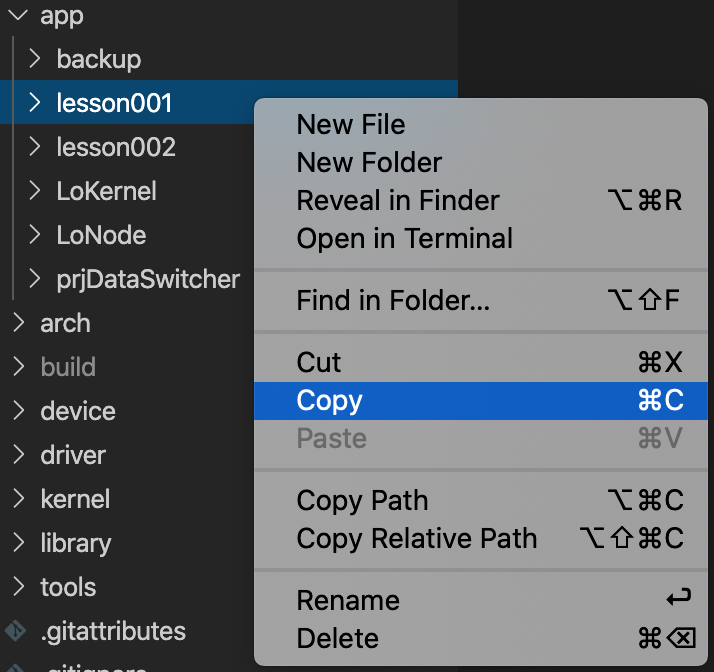
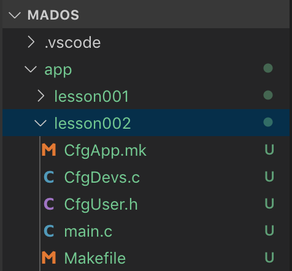
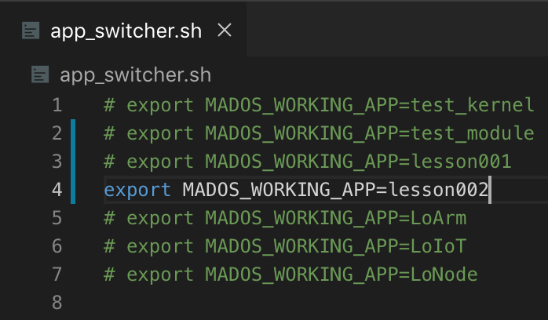
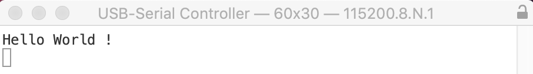

# Hello World

## 新建项目
:::tip
有时，Copy->Paste是解决问题的最佳方式。
:::
### Copy
复制lesson01:
  
### Paste
粘贴至App目录下，并重命名为lesson02:

### Switch
最后，在app_switcher.sh中添加并切换至lesson02项目:
<!--  -->
```sh
# export MADOS_WORKING_APP=LoKernel
# export MADOS_WORKING_APP=LoNode
# export MADOS_WORKING_APP=lesson001
export MADOS_WORKING_APP=lesson002
```
:::tip
编辑**app_switcher.sh**后记得运行**config**及**rebuild**任务，以便正确重构新项目。
:::

## 标准输出
### 设备文件
**device** 目录下已为开发者提供了标准字符设备 **DevTty.c**
``` bash
device
├─ stm32f10x
│  ├─ DevTty.c  # 标准字符设备
│  ├─ ...       # 其他设备
│  └─ Makefile  # 编译文件
└─ Makefile     # 编译文件
```

### 设备描述
```c
#include <stdarg.h>
#include <stdio.h>
#include "MadDev.h"
#include "usart_char.h"
#include "CfgUser.h"
// 定义底层接口
static mUsartChar_t port;
// 定义中断函数
static void Dev_Irq_Handler(void) { mUsartChar_Irq_Handler(&port); }
// 定义底层接口初始化参数
static const mUsartChar_InitData_t LowArgs = {
    USART2,
    DMA1_Channel7,
    DMA1_Channel6,
    { 
        GPIO_Remap_USART2,
        { GPIOD, GPIO_Pin_5 },
        { GPIOD, GPIO_Pin_6 }
    },
    ISR_PRIO_TTY_USART,
    115200,              // 波特率
    USART_WordLength_8b, // 数据位
    USART_StopBits_1,    // 停止位
    USART_Parity_No,     // 校验模式
    USART_Mode_Rx | USART_Mode_Tx,
    USART_HardwareFlowControl_None, // 流控模式
    DMA_Priority_Low,
    DMA_Priority_Low,
    Dev_Irq_Handler
};
// 定义设备初始化参数
static const MadDevArgs_t Args = {
    MAD_WAITQ_DEFAULT_SIZE, // 等待队列长度
    128,                    // 发送缓存尺寸
    128,                    // 接收缓存尺寸
    &LowArgs
};
// 定义设备
MadDev_t Tty = { "tty", &port, &Args, &MadDrvUartChar, NULL };
```
:::tip
MadOS使用设备文件管理设备，设备文件与硬件平台相关。    
通常，设备文件由MadOS提供或由驱动工程师制作，app开发者无需关心底层细节。   
设备文件中包含默认的初始化参数，对于tty设备，开发者只需关心:
| 功能 | 说明 |
| :-| :-|
| 波特率 | 按需设置 |
| 数据位 | 按需设置 |
| 停止位 | 按需设置 |
| 校验方式 | 按需设置 |
| 硬件流控 | 按需设置(通常无需关心) |
| 等待队列 | 按需设置(通常无需关心) |
| 缓存尺寸 | 按需设置(通常无需关心) |
:::

### 设备列表
将标准输出设备(**Tty**)加入设备列表(**CfgDevs.c**):
```c
#include "MadDev.h"

extern MadDev_t Tty;

MadDev_t *DevsList[] = {
    &Tty,
    MAD_DEVP_END
};
```
:::tip  
使用设备列表，read、write等原子操作中，可一步定位设备，大幅提升读写效率。
:::

## 修改源码
### main()
为后续调试方面，我们把基本的硬件初始化都放在前部。
```c
int main()
{
    do { // Enable GPIOs and DMAs
        RCC_APB2PeriphClockCmd(RCC_APB2Periph_AFIO, ENABLE);
        RCC_APB2PeriphClockCmd(RCC_APB2Periph_GPIOA, ENABLE);
        RCC_APB2PeriphClockCmd(RCC_APB2Periph_GPIOB, ENABLE);
        RCC_APB2PeriphClockCmd(RCC_APB2Periph_GPIOC, ENABLE);
        RCC_APB2PeriphClockCmd(RCC_APB2Periph_GPIOD, ENABLE);
        RCC_APB2PeriphClockCmd(RCC_APB2Periph_GPIOE, ENABLE);
        RCC_AHBPeriphClockCmd(RCC_AHBPeriph_DMA1, ENABLE);
        RCC_AHBPeriphClockCmd(RCC_AHBPeriph_DMA2, ENABLE);
        GPIO_PinRemapConfig(GPIO_Remap_SWJ_JTAGDisable, ENABLE);
    } while(0);
    
    do { // 25MHz-Output For IP101A
        GPIO_InitTypeDef gpio;
        gpio.GPIO_Mode  = GPIO_Mode_AF_PP;
        gpio.GPIO_Speed = GPIO_Speed_50MHz;
        gpio.GPIO_Pin   = GPIO_Pin_8;
        GPIO_Init(GPIOA, &gpio);
        RCC_MCOConfig(RCC_MCO_HSE);
    } while(0);

    madCopyVectorTab();                         // 将中断向量表复制到RAM中
    madOSInit(MadStack, MAD_OS_STACK_SIZE);     // MadOS初始化
    madThreadCreate(madStartup, 0, MAD_OS_STACK_SIZE / 2, 0); // 新建线程
    madOSRun();                                 // 启动MadOS
	while(1);                                   // !永远不该运行至此!
} // 以上是MadOS的启动过程，初学者不必深究，随后的学习中会逐步了解其原理
```

### madStartup()
在线程中加入标准输出设备初始化及打印函数。
```c
static void madStartup(MadVptr exData)
{
    // 初始化SysTick，脉动间隔1ms。
    madInitSysTick(DEF_SYS_TICK_FREQ, DEF_TICKS_PER_SEC);
    // 初始化标准C库
    Newlib_Init();
    // 初始化 tty 用作标准输出
    MAD_LOG_INIT();
    // 输出 Hello World !
    printf("Hello World !\n");
    // 线程主循环
    while(1) {
        // 近乎无限休眠
        madTimeDly(0xFFFFFFFF);
	}
}
```

## 调试程序
### 设置串口工具
连接**开发版**的调试串口(J16)与**开发主机**的USB端口，并启动串口调试工具。  
:::tip
默认串口参数:
| 功能 | 说明 |
| :-| :-|
| 波特率 | 115200 |
| 数据位 | 8 |
| 停止位 | 1 |
| 校验方式 | 无 |
:::

### 启动调试
从vscode中启动调试，可在串口调试工具中看到输出: 

