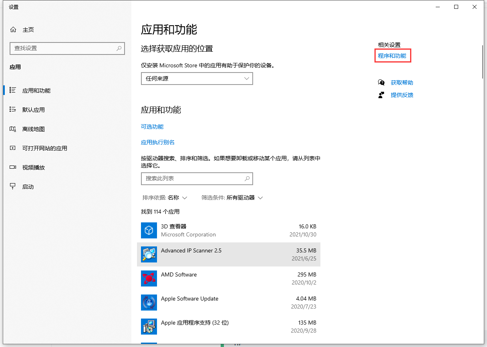
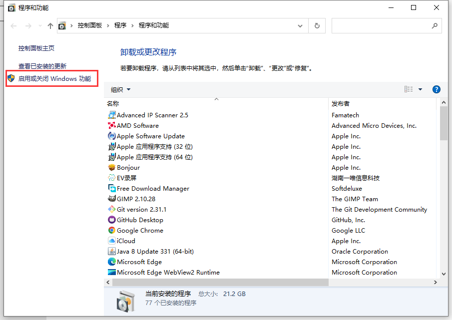
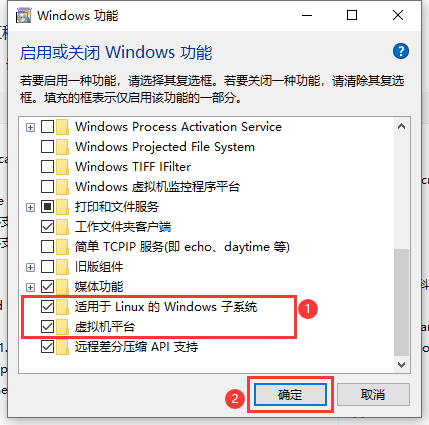

# 搭建环境

## 获取工具链
我们已为开发者准备好工具链:  
| 平台 | 提取码 |
| :----: | :----: |
| [MacOSX](https://pan.baidu.com/s/12RdYZJD5p37PpwuKFaGSgA)  | dijo |
| [Windows](https://pan.baidu.com/s/1McsnJkOcz_DGlXZUXg4iwQ) | adng |

## 配置工具链
首先，将工具链解压到磁盘上，然后，设置几个环境变量:

### MacOSX / Ubuntu  
假设解压路径为: /home/creator
``` bash
export MADOS_TOOLS_VER=12.1.0
export MADOS_TOOLS_HOME=/home/creator/mados-tools/tools
export MADOS_TOOLS_GCC=$MADOS_TOOLS_HOME/arm-none-eabi-$MADOS_TOOLS_VER
export MADOS_TOOLS_OPENOCD=$MADOS_TOOLS_HOME/openocd
export MADOS_TOOLS_BIN=$MADOS_TOOLS_GCC/bin:$MADOS_TOOLS_OPENOCD/bin
export PATH=$MADOS_TOOLS_BIN:$PATH
```
将以上内容加入到用户配置文件末尾
| 平台 | 用户配置文件 |
| :----: | :---- |
| MacOSX | ~/.zprofile |
| Ubuntu | ~/.bashrc   |
执行以下命令：
``` bash
source ~/.zprofile # MacOSX
```
``` bash
source ~/.bashrc   # Ubuntu
```

### Windows
我们提供基于 WSL2 + Ubuntu 的整体开发环境，以减少开发者踩坑周期。

#### 在Windows中开启 WSL2 支持
- "硬件虚拟化":  
根据主板手册在 BIOS 中设置
- "程序与功能":  

- "启用或关闭 Windows 功能":  

- "适用于 Windows 的 Linux 子系统 & 虚拟机平台"


#### WSL2 更新&设置
``` powershell
wsl --update
wsl --set-default-version 2
```

#### 导入开发环境
- 新建文件夹，用作存放导入的开发环境。  
如: D:\wsl-ubuntu-20.04
- 导入
``` powershell
wsl --import Ubuntu-20.04 D:\wsl-ubuntu-20.04 mados-tools-12.1.0-WSL2.tar
```

#### usbipd-win 安装
[下载地址](https://github.com/dorssel/usbipd-win/releases)

#### (可选)高级用户
[独立工具链](https://pan.baidu.com/s/1O06wnQdNvJqfEwctte6UHQ)  
提取码: 9qbx

## 安装代码编辑器
推荐使用[Visual Studio Code](https://code.visualstudio.com/)作代码编辑工具。
::: tip
- [下载缓慢看这里](https://zhuanlan.zhihu.com/p/112215618)
- 设置环境变量后，需重启VSCode，以使其加载新环境变量。
:::

### 安装 VSCode 扩展
| 扩展名 | 发布者名称 |
| :----: | :----: |
| AutoLaunch   | philfontaine    |
| C/C++        | Microsoft       |
| Lua          | sumneko         |
| Arm Assembly | dan-c-underwood |
| Cortex-Debug | marus25         |
::: tip
- MadOS支持Lua，详见后续章节。
:::

## 验证

### GCC
执行
``` bash
arm-none-eabi-gcc -v
```
输出版本信息
``` bash
gcc version 12.1.0 (GNU Tools for MadOS [ARM][20220526][gcc-12.1.0][Newlib])
```

### GDB
执行
``` bash
arm-none-eabi-gdb -v
```
输出版本信息
``` bash
GNU gdb (GNU Tools for MadOS [ARM][20220526][gdb-12.1]) 12.1
```

### OpenOCD
执行
``` bash
openocd -v
```
输出版本信息
``` bash
xPack OpenOCD arm64 Open On-Chip Debugger 0.11.0+dev (2022-03-25-19:31)
```
